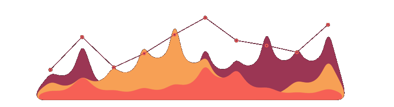

## 👋 Hi

  
  

---

### 🚀 Инструменты:

    
    
    
    
    
    

    
    
    
    
    

---

### 📊 Проекты:

<table align="center">
  <thead>
    <tr>
      <th>📌 Название</th>
      <th>🛠️ Инструменты</th>
    </tr>
  </thead>
  <tbody>
    <tr>
      <td><a href="https://github.com/silvercloud1442/ChurnPredict">Анализ оттока клиентов</a></td>
      <td>
        
        
        
        
        
      </td>
    </tr>
    <tr>
      <td><a href="https://github.com/silvercloud1442/ClientsSegmentation">Сегментация клиентов с помощью кластеризации  </a></td>
      <td>
        
        
        
      </td>
    </tr>
  </tbody>
</table>

